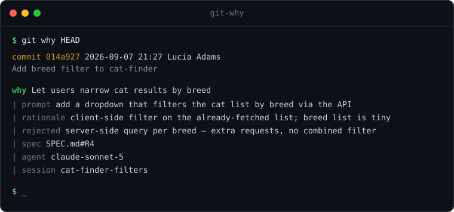

<h1 align="center">git why</h1>

<p align="center">
  <strong><code>git blame</code> tells you <em>who</em>. <code>git why</code> tells you <em>why</em>.</strong>
</p>

<p align="center">
  <a href="https://github.com/maledadams/git-why/actions/workflows/ci.yml"></a>
  
  
  
  
</p>

When you build software by directing an AI, the reasoning behind each change lives in a
chat window that closes. Six months later the code is still there and the *why* is gone.
`git why` keeps it — on the commit itself, as standard
[git trailers](https://git-scm.com/docs/git-interpret-trailers), so it travels with every
clone, fetch and push and shows up in plain `git log`.

<p align="center">
  
</p>

## Install

```bash
pipx install git+https://github.com/maledadams/git-why
```

or drop the single file on your `PATH` — no build, no dependencies:

```bash
curl -fsSL https://raw.githubusercontent.com/maledadams/git-why/main/git_why.py -o ~/.local/bin/git-why
chmod +x ~/.local/bin/git-why
```

Git picks it up as a subcommand automatically: `git why`.

## Quickstart

```bash
git why init                        # install the hook (once per repo; tip-only, never blocks)

git why commit -m "add breed filter" \
  -b "let users narrow cat results by breed" \
  --rationale "client-side filter on the already-fetched list" \
  --agent claude-sonnet-5

git why HEAD                        # reasoning for a commit
git why src/filter.ts              # reasoning for the last change to a file
git why log --since "7 days ago"   # the reasoning trail
git why log --agent claude-sonnet-5
git why export > reasons.ndjson    # every recorded reason, one JSON object per line
git why check origin/main..HEAD    # optional CI gate (see "How much it enforces")
```

You never *have* to use `git why commit` — a plain `git commit --trailer "Why: ..."` works
the same. The wrapper is just shorter.

## What gets stored

Reasoning is stored as trailers on the commit message. `Why:` is the one that matters; the
rest are optional.

| Trailer             | Meaning                                        |
| ------------------- | ---------------------------------------------- |
| `Why:`              | why this change exists                         |
| `Why-Prompt:`       | the instruction that produced it               |
| `Why-Rationale:`    | why this approach                              |
| `Why-Alternatives:` | what was considered and rejected               |
| `Why-Spec:`         | requirement / issue it satisfies               |
| `Why-Agent:`        | model + tool that wrote it                     |
| `Why-Session:`      | id grouping commits from one work session      |
| `Why-Confidence:`   | `low` / `medium` / `high` / `human-reviewed`   |
| `Why-Skip:`         | this commit deliberately has no reason, and why |

## How it works

- **Trailers, not a database.** Everything lives in the commit message's last paragraph,
  the same place as `Co-Authored-By:`. Nothing to host, nothing to sync.
- **`git why export`** turns the whole history into NDJSON — one object per commit, every
  `Why-*` field as a key. That's the point of a schema: you can filter and analyse it
  (`--agent`, `--session`, `--spec` on `git why log`) instead of grepping prose.
- **`git why check`** applies the same rule in CI.

## How much it enforces

**By default, nothing is blocked.** `git why init` installs a `commit-msg` hook that stays
out of your way. `git config why.strict` sets how loud it is:

| Level                    | On a *substantial* change with no reason…                       |
| ------------------------ | -------------------------------------------------------------- |
| `nudge` *(default)*      | commit goes through; one line on stderr saying how to add a reason |
| `substantial`            | commit is **blocked** until you add a reason (`git why init --enforce`) |
| `all`                    | as above, on **every** non-merge commit (`git why init --all`) |
| `off`                    | completely silent (`git why init --silent`)                    |

"Substantial" = more than ~15 non-generated lines, and the subject isn't
`chore/build/ci/revert/bump`. Lockfiles, `*.min.*` and snapshots don't count toward the
size. Trivial changes are never touched, at any level. Tune it:
`git config why.threshold 30`, `git config why.skip-paths "docs/*,*.md"`.

At the `substantial` / `all` levels a *weak* reason is rejected too — a `Why:` that just
repeats the subject, or filler like `update` / `wip` / `fix`.

Any commit can opt out on purpose, and the reason for skipping is recorded:
`git commit --trailer "Why-Skip: vendored, not our code"`.

## For AI agents

`git why agent-setup` prints a block to paste into `CLAUDE.md`, `.cursorrules`, or wherever
your agent reads instructions. The gist:

> Commit with `git why commit -m "<subject>" -b "<why this change exists>" --prompt "<the request>" --agent "<model>"`.
> Write the reason yourself from the conversation — it's intent the user never has to type.
> Trivial changes can use a bare `git commit`.

The default hook never blocks the agent — it just leaves a tip if a real change went in
with no reason. Turn on `--enforce` once you trust the workflow.

## Why not just keep the chat logs

Chat logs aren't attached to the code, aren't in the repo, don't survive a clone, and
nobody greps them. A trailer is one line, lives on the commit, and `git log` already
shows it.

## Roadmap

Kept deliberately small. Planned next, roughly in order:

- git notes fallback for prompts too long to sit in a message
- an editor-time staging file so an agent can record intent before it commits
- editor integrations (VS Code, Neovim) surfacing `git why` on the current line
- `git why blame <file>` — blame, but the last column is the reason

## Contributing

Issues and PRs are welcome, including from first-timers — see
[CONTRIBUTING.md](CONTRIBUTING.md) and the
[`good first issue`](https://github.com/maledadams/git-why/labels/good%20first%20issue) label.

## License

MIT © Lucia Adams
